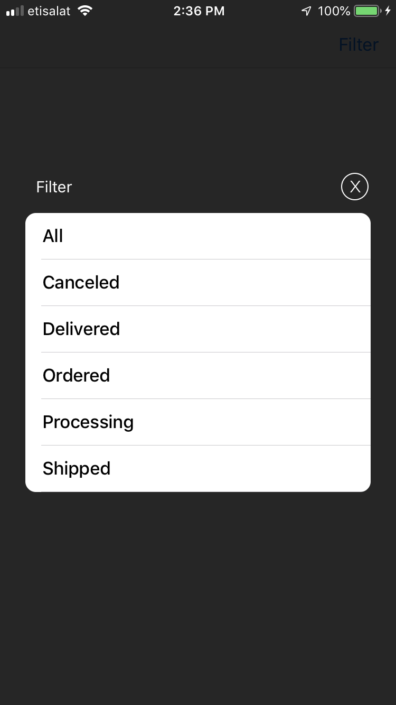

# HGPopUp
this repository is a custom popup that will make the user have the ability to select from the values that are shown in the pop up with a protocol communication between the pop up and the view controller. 

# Notes
### Tips
* all you need is to wite this:
- let presenter = HGPopUpPresenter(vc: self)
- presenter.present(.HGPopUp(withValues: Filter.values, AndTitle: Filter.title)) 
- listen for the HGPopUpProtocol.
And all the logic will handled for you 

### ScreenShots

